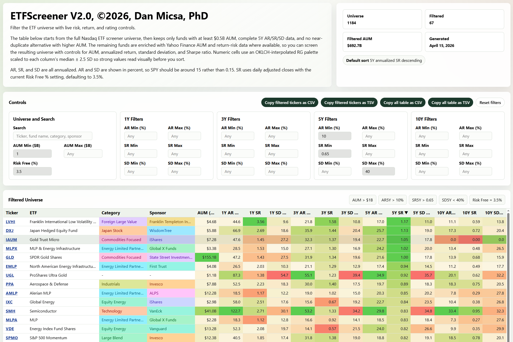

# ETFScreener



This repository generates a static HTML ETF screener from the full Nasdaq ETF universe.

The generator code lives in `Code\GenerateETFScreener.ts`. The main output, `ETFScreener.html`, is self-contained: you can open it directly in a browser with no local server, build step, or extra update required.

## Prerequisites

- Deno 2.x
- Outbound network access to Nasdaq and Yahoo Finance

The current generator uses `yahoo-finance2`, which expects Deno 2.x. Earlier Deno versions may still run, but they are not the supported target.

In this workspace the package can still emit a stale "found 1.40.3" warning even when the actual runtime is Deno 2.x, so confirm the real version with `deno --version` before treating that message as authoritative.

## Quick Start

From the repository root, run:

```powershell
.\GenerateETFScreener.bat
```

That writes `ETFScreener.html` in the repository root. Open `ETFScreener.html` directly in a browser.

## Raw Deno Command

If you want to run the generator without the batch wrapper:

```powershell
deno run -A .\Code\GenerateETFScreener.ts
```

The generator defaults now write to these root-level files:

- `ETFScreener.html`
- `Code\cache.json`

## Command-Line Options

- `--output=<path>`: output HTML file
- `--cache=<path>`: JSON cache used for enriched ETF data
- `--symbols=SPY,VOO,QQQ`: optional ticker subset; omit this flag to process the full universe

## Files In This Repo

- `Code\GenerateETFScreener.ts`: the generator script
- `Code\Info.txt`: the visible name/version/copyright line used in the first hero box and browser title
- `Code\ETFScreener.png`: the screenshot shown at the top of this README
- `GenerateETFScreener.bat`: root wrapper for generating the screener
- `ETFScreener.html`: current full generated screener
- `Code\cache.json`: cached enrichment results

## What The Generated HTML Contains

The generated page is a single self-contained HTML file with embedded ETF data and client-side controls. It includes:

- search by ticker, fund name, category, or sponsor
- minimum and maximum AUM filters
- 1Y, 3Y, 5Y, and 10Y filters for annualized return, standard deviation, and Sharpe ratio
- sponsor and ETF names cleaned for readability by removing duplicated sponsor prefixes and common ETF label noise
- near-duplicate ETFs removed, keeping the more popular fund first because pruning happens after sorting by AUM
- ticker symbols linked directly to the Yahoo Finance quote page for that fund
- filtered counts, filtered AUM, and CSV/TSV copy support for filtered tickers or the full visible table
- filter and sort persistence in the browser so the current view survives reloads

No local server or front-end build step is required after generation.

## Refresh Behavior

- The cache TTL is 72 hours
- Delete `Code\cache.json` or point `--cache` at a different file to force a full refresh
- The output keeps only ETFs with at least $0.5B AUM and complete 5Y AR/SR/SD data
- Very similar ETFs are pruned from the final output, keeping the most popular fund first because similarity pruning runs after sorting by AUM
- Some symbols are excluded intentionally in the generator (`SGOL`, `GLDM`, `BAR`)

## Troubleshooting

- If the script fails early, check your Deno version with `deno --version`
- If `yahoo-finance2` prints an "Unsupported environment" warning that mentions Deno 1.40.3, verify the real runtime first; that warning can be stale even on Deno 2.x
- If you run the raw Deno command from outside the repository root, relative paths resolve from your current working directory; `GenerateETFScreener.bat` avoids that by switching to the repo root first

## Copyright And Permission

Copyright (c) 2026 Dan Micsa, PhD.

Permission is hereby granted, free of charge, to any person obtaining a copy of this software and associated documentation files to use, copy, modify, merge, publish, distribute, sublicense, and/or sell copies of the software for any purpose, including commercial use, provided that this copyright notice and this permission notice are included in all copies or substantial portions of the software.

THE SOFTWARE IS PROVIDED "AS IS", WITHOUT WARRANTY OF ANY KIND, EXPRESS OR IMPLIED, INCLUDING BUT NOT LIMITED TO THE WARRANTIES OF MERCHANTABILITY, FITNESS FOR A PARTICULAR PURPOSE, AND NONINFRINGEMENT. IN NO EVENT SHALL THE AUTHOR BE LIABLE FOR ANY CLAIM, DAMAGES, OR OTHER LIABILITY, WHETHER IN AN ACTION OF CONTRACT, TORT, OR OTHERWISE, ARISING FROM, OUT OF, OR IN CONNECTION WITH THE SOFTWARE OR THE USE OR OTHER DEALINGS IN THE SOFTWARE.
